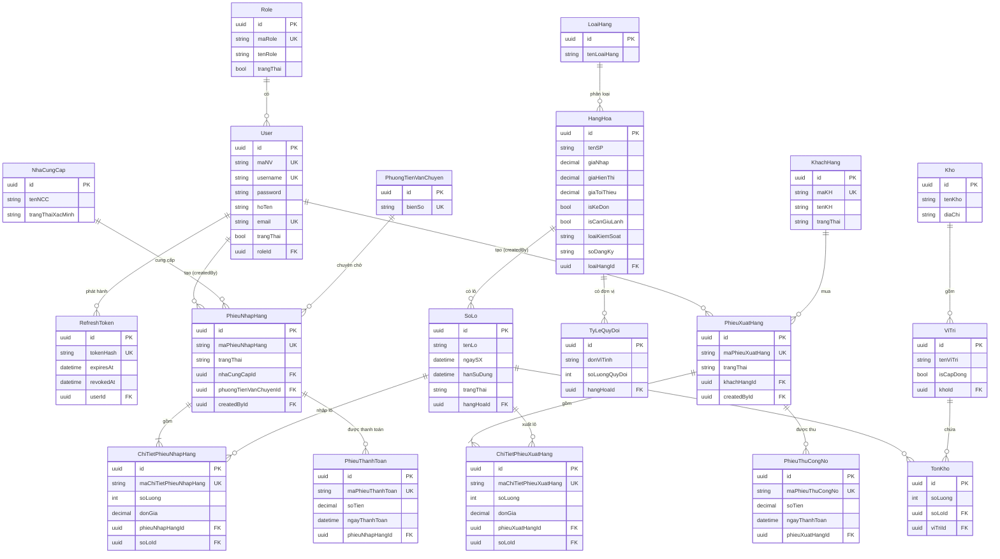

# ERD

Nguồn: `prisma/schema.prisma` (19 model). File này mô tả **schema hiện tại**; các thay đổi đề xuất nằm ở [schema-notes.md](schema-notes.md) và được đánh dấu *(đề xuất)*.

## 1. Sơ đồ tổng thể

(Sơ đồ chỉ liệt kê các trường chính để dễ đọc; danh sách đầy đủ ở `schema.prisma`.)

## 2. Theo bounded context

### 2.1 Định danh & phân quyền — module `auth`, `users`, `roles`
`Role (1) — (n) User (1) — (n) RefreshToken`. `User.roleId` nullable: user chưa gán role đăng nhập được nhưng bị `403` ở mọi route có `@Roles`. `RefreshToken` xóa cascade theo user. `User` cũng là đầu mối "người tạo" của phiếu nhập/xuất (`createdById`, nullable, chỉ phục vụ thống kê).

### 2.2 Danh mục hàng hóa — `loai-hang`, `hang-hoa`, `ty-le-quy-doi`
`LoaiHang (1) — (n) HangHoa (1) — (n) TyLeQuyDoi`. `TyLeQuyDoi` biểu diễn các đơn vị tính của một hàng (viên = 1, vỉ = 10, hộp = 100). Mỗi `HangHoa` phải có đúng một đơn vị cơ bản (`soLuongQuyDoi = 1`) — ràng buộc ở tầng service, không có ở schema.

### 2.3 Lô & tồn kho — `so-lo`, `kho-vi-tri`, `ton-kho`
`HangHoa (1) — (n) SoLo`; `Kho (1) — (n) ViTri`; `TonKho` là bảng liên kết nhiều–nhiều `SoLo × ViTri` với `@@unique([soLoId, viTriId])` và `soLuong`. Một lô có thể nằm ở nhiều vị trí; một vị trí chứa nhiều lô.

### 2.4 Đối tác — `khach-hang`, `nha-cung-cap`, `phuong-tien-van-chuyen`
Ba bảng độc lập, không quan hệ lẫn nhau. `KhachHang → PhieuXuatHang`, `NhaCungCap → PhieuNhapHang`, `PhuongTienVanChuyen → PhieuNhapHang` (hiện **chỉ** gắn với phiếu nhập).

### 2.5 Nhập hàng — `phieu-nhap-hang`, `phieu-thanh-toan`
`PhieuNhapHang (1) — (n) ChiTietPhieuNhapHang`; mỗi dòng trỏ một `SoLo`. `PhieuNhapHang (1) — (n) PhieuThanhToan`.

### 2.6 Xuất hàng — `phieu-xuat-hang`, `phieu-thu-cong-no`
`PhieuXuatHang (1) — (n) ChiTietPhieuXuatHang`; mỗi dòng trỏ một `SoLo` (truy vết lô). `PhieuXuatHang (1) — (n) PhieuThuCongNo`.

## 3. Khoảng trống nhận thấy trong ERD hiện tại

Các điểm dưới đây khiến nghiệp vụ không thể triển khai đúng nếu chỉ dùng schema hiện tại; đề xuất xử lý nằm ở [schema-notes.md](schema-notes.md) (mã `P-xx`):

| Khoảng trống | Hệ quả | Đề xuất |
|---|---|---|
| Dòng chi tiết nhập/xuất không có `viTriId` | Không biết cộng/trừ tồn ở `TonKho` dòng nào | P-08 |
| Dòng chi tiết không có đơn vị tính | `soLuong` mơ hồ (viên hay hộp?) | P-07 |
| `HangHoa` không có mã sản phẩm | Không có khóa nghiệp vụ để tra cứu/in phiếu | P-17 |
| `NhaCungCap` không có mã, không có cờ hoạt động | Không phân biệt/vô hiệu hóa được | P-11 |
| Phiếu không có `updatedAt`, người xác nhận, thời điểm xác nhận, lý do hủy | Không có vết cho các chuyển trạng thái | P-02, P-09 |
| `PhieuXuatHang` không gắn phương tiện | Không biết xe nào giao | P-09 |
| Phiếu thu/thanh toán không thể hủy, không có người tạo | Sai thì không sửa được | P-10 |
| `SoLo` không unique theo `(hangHoaId, tenLo)` | Trùng lô | P-04 |
| Không có sổ biến động tồn | Không truy vết được vì sao tồn thay đổi | P-13 |
| `PhieuNhapHang.createAt` đặt tên lệch | Không nhất quán | P-20 |
